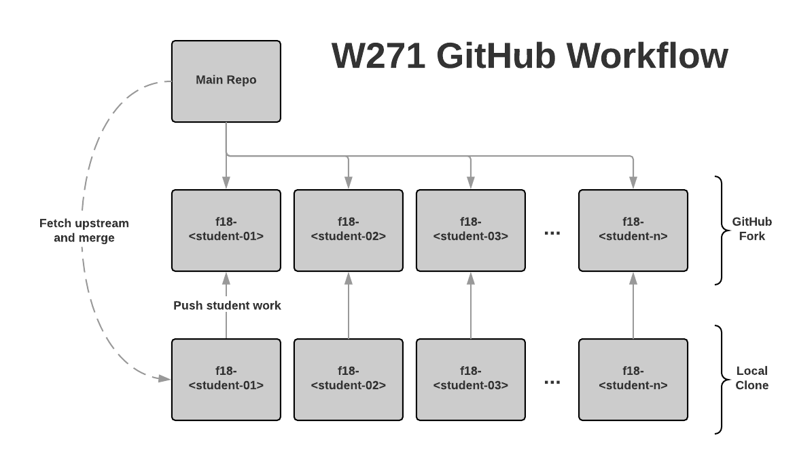

# main-2019-spring

# Statistical Methods for Discrete Response, Time Series, and Panel Data (W271)

This is the main development repository for W271 through which all course material will be dispersed. Students will create their own forks through GitHub Classroom to submit assignments.

## Course Outline
The course is divided into three parts, covering a range of foundational statistical models for modeling discrete response, time-series, and panel data.

### Part 1 (Week 1 – 5): Discrete Response Modeling (DRM)
  * Bernoulli, Binomial, Multinomial, and Poisson probability distributions
  * Maximum likelihood estimation
  * Profile likelihood ratio test
  * Inference for the probability of an event and the use of Wald, Wilson, Agresti-Coull, and Clopper-Pearson confidence intervals
  * Odds, relative risks, and odd ratios
  * Binary logistic regression model
  * Multinomial logistic regression model
  * Poisson regression model
  * Hypothesis testing for regression parameters
  * Log-odds of an event and its relationship to binary logistic regression models
  * Probability of an event in the context of binary logistic regression models
  * Variable (nonlinear) transformation and interactions
  * Contingency tables and the associated inference procedures
  * Test for independency
  * Model specification
  * Model evaluation
  * Model selection

### Part 2 (Week 6 – 10): Time Series Analysis (TSA)
  * Common time series patterns
  * Autocorrelation and partial autocorrelation
  * Notions and measures of stationarity
  * Exploratory time series data analysis
  * Time series regression
  * Akaike’s Information Criterion (and its bias corrected version) and Bayesian Information Criterion (BIC)
  * Model selection based on out-of-sample forecast error
  * Time series smoothing and filtering techniques
  * Stationary and non-stationary time series processes
  * Stationary Autoregressive (AR), Moving Average (MA), and Mixed Autoregressive Moving Average (ARMA) processes
  * ARIMA model
  * Seasonal ARIMA model
  * Estimation, diagnostic checking of model residuals, assumption testing, statistical inference, and forecasting
  * Regression with autocorrelated errors
  * Autoregressive Integrated Moving Average (ARIMA) Model
  * Unit roots, Dickey-Fuller (ADF) test, and Phillips-Perron tests
  * Spurious regression and Co-integration
  * Vector Autoregressive (VAR) Models

### Part 3 (Week 11 – 13): Panel Data Modeling (PDM)
  * Exploratory panel data analysis
  * Pooled OLS regression model
  * First-differenced regression model
  * Distributed lag model
  * Fixed-effect regression model
  * Random-effect regression model
  * Linear mixed-effect model

## Required Textbooks and Other Course Resources
  1.	**[BL]** Christopher R. Bilder and Thomas M. Loughin. Analysis of Categorical Data with R. CRC Press. 2015.
  2.	**[HA]** Rob J Hyndman and George Athanasopoulos. Forecasting: Principles and Practice. https://www.otexts.org/fpp2
  3.	**[CM]** Paul S.P. Cowpertwait and Andrew V. Metcalfe. Introductory Time Series with R. Springer. 2009. (ISBN-10: 978-0-387-88697-8)
  4.	**[W]** Jeffrey Wooldridge. Introductory Econometrics: A Modern Approach. 6th edition. Cengage Learning. (ISBN-10: 130527010X)
  5.	**[BMBW]** Douglas Bates, Martin Machler, Benjamin Bolker, and Steve Walker. Fitting Linear Mixed Effect Models Using lme4
  6.	Additional papers, articles, and readings may be provided throughout the course.

## Class Schedule

  __Office Hours:__  
  Monday 5:35-6:25pm PT (Jeffrey)  
  Thursday 5:00-6:00pm PT (Rahul)  
  Sunday 3:30-4:30pm PT (Gerard)

  **Add/Drop Deadline for MIDS Students: Saturday May 18**

  | Date   | Week    | Topic                    | Readings | Labs |
  |--------|--|---------------------------|------------|------------|
  |May 6  | 1  | DRM 1 | BL: Ch. 1 (Skip 1.2.6 and 1.2.7)     | |
  |May 13 | 2  | DRM 2 | BL: Ch. 2.1, 2.2.1 – 2.2.4     | Lab 1 assigned |
  |May 20 | 3  | DRM 3 | BL: Ch. 2.2.5 – 2.2.7, 2.3     | |
  |May 27 | | | Academic & Admin. Holiday | Lab 1 due |  
  |Jun 3  |  4  | DRM 4 | BL: Ch.3 (Skip 3.4.3, 3.5)     | Lab 2 assigned |
  |Jun 10 |  5  | DRM 5 | BL: Ch.4.1, 4.2.1 – 4.2.3, 5.1 - 5.4 (Skim 5.2.3, 5.3)| |
  |Jun 17 |  6  | TSA 1    | CM: Ch. 1, 2.1.1, 2.2.4, 2.2.5, 2.3, 4.2 (Skip Ch. 1.5.4, 1.5.5)    | Lab 2 due |
  |Jun 24  |  7  | TSA 2    | CM: Ch. 5.1 – 5.3 (Optional: CM: Ch. 3.4; HA: Ch.7    | |
  |Jul 1 |  8  | TSA 3    | CM: 3.1, 3.2, 4.5, 6.1 – 6.4; HA: Ch. 8.2, 8.3, 8.4     | |
  |Jul 8 |  9  | TSA 4    | CM: Ch. 4.3 – 4.7, 6, 7.1 – 7.3; HA: Ch. 8.5 – 8.9 | Lab 3 assigned |
  |Jul 15 |  10 | TSA 5    | CM: Ch.11; HA: Ch. 11.2 | |
  |Jul 22  |  11 | PDM 1    | W: Ch. 13 (skip 13.4) | Lab 3 due   Lab 4 assigned|
  |Aug 29  |  12 | PDM 2    | W: Ch. 14.1 – 14.2 |  |
  |Aug 5 |  13 | PDM 3    | BMBW | Lab 4 due |

## Student Repository Setup

1. The GitHub Classroom link will be distributed through Slack. Click on the link and _Accept Assignment_. GitHub Classroom automatically forks the main repository for the student (e.g. `2019-summer-<student_name>`).
2. [Clone the fork](https://help.github.com/articles/cloning-a-repository/) using either the GitHub Desktop GUI or command line interface.
3. [Configure](https://help.github.com/articles/configuring-a-remote-for-a-fork/) the upstream remote. This is necessary to merge weekly updates into your personal repository.
`git remote add upstream https://github.com/MIDS-W271/main-2019-summer.git`
4. Instructors will update material throughout the semester in the main (aka upstream) repository. [Fetch and Merge](https://help.github.com/articles/syncing-a-fork/) from the remote regularly.
5. To submit weekly homework, students should commit and push their work to `2019-spring-<student_name>`.

